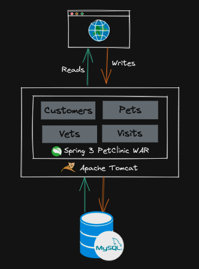

# Application Modernisation using Strangler Fig Pattern

This repo contains a step-by-step tutorial on implementing a strangler fig pattern using CDC (Change Data Capture) to decompose a legacy monolith into microservices and deploying to Kubernetes.

See Git tags for step-by-step progress of modernisation of the application in scope. Clone this repository and run the below command from the root of the project folder:

```text
$ git tag -ln

v1.0.0			Spring PetClinic Monolith Baseline
v2.0.0                  Add Strangler Proxy
v3.0.0                  Create new replacement service
v4.1.0                  Setup Debezium for CDC from MySQL source
v4.2.0                  Build data streaming pipeline to emit aggregated results 
v4.3.0                  Setup sink connector to MongoDB
```

## Introduction
One of the most common techniques in application modernization is the Strangler Fig Pattern. Martin Fowler first captured this [pattern](https://martinfowler.com/bliki/StranglerFigApplication.html), inspired by a certain type of fig that seeds itself in the top branches of trees. The fig then descends towards the ground to take root, gradually enveloping the original tree. At first the existing tree becomes a support structure for the new fig but eventually the fig grows into a beautiful structure, fully self-supporting where it starts consuming the nutrients/resources from the original tree leaving it  to die and rot


In the context of app modernization we can draw a parallel here, where we can incrementally build microservices that replicate functionality of the existing monolith. The idea is that the old legacy monolith  and the new microservices can coexist, and we can evolve the new services over time with the same functionality provided by the monolith and eventually replacing the old system

The following sections describe the Git commit tags (shown above) made in order to modernise the Spring PetClinic application using the Strangler Fig Pattern.

### v1.0.0 - Spring PetClinic Monolith Baseline
<hr/>

Spring PetClinic is an open-source sample application created by SpringSource for the Spring Framework. It is designed to display and manage information related to pets and veterinarians in a pet clinic. Instructions to run the baseline application locally can be found in the [spring-petclinic/README.md](spring-petclinic/README.md) file.



The monolithic application consists of four different modules all packaged and deployed as a single artefact onto a Tomcat Application server. All data related to the modules is stored in a single MySQL database.

### v2.0.0 - Add Strangler Proxy
<hr/>

Introduce a proxy into the infrastructure and configure the network to route all monolith traffic via it. The proxy will initially allow all traffic to pass through unmodified to the monolith. Its configuration will be gradually updated as new microservices are developed, routing specific requests to the newly created microservices.


- Change the Apache Tomcat web server port to `8080` from `80`. The NGINX web server will instead listen to incoming connections on port `80`.

- Define the basic [configuration](docker/nginx/config/nginx.conf) for an NGINX reverse proxy to route all incoming traffic on port `80` to the tomcat web server port `8080` where the spring-petclinic application is running.
   
- From the root folder of the project, run the following command to start the docker containers

    ```bash
     docker compose up -d
  ```
    The [docker-compose.yaml](docker-compose.yaml) in the root folder reuses the docker compose [file](spring-petclinic/docker-compose.yml) inside the spring-petclinic project. By running the command above it will start the spring-petclinic app, MySQL and NGINX container. 

Access the NGINX index page on [http://strangler-fig.demo/](http://strangler-fig.demo/).

The PetClinic application can be accessed on : [http://strangler-fig.demo/petclinic](http://strangler-fig.demo/petclinic)

### v3.0.0 - Create new replacement service 
<hr/>

Incrementally build the owner functionality in a new microservice. The new service is re-written using a modern toolkit.  Instructions to run the baseline application locally can be found in the [petclinic-owner-service/README.md](petclinic-owner-service/README.md) file.

It is worth noting that in this step , we can have the new service deployed into a production environment and wait until the functionality is full tested, with the understanding that no live traffic is handled by the new service


In this step, only the READ functionality is implemented within the new microservice.

| Description      | HTTP Method | API               | Implemented |
|------------------|-------------|-------------------|-------------|
| Find Owners      | GET         | /owners/find      | Yes         |
| List All Owners  | GET         | /owners           | Yes         |
| Get Owner by Id  | GET         | /owners/{id}      | Yes         |
| Create New Owner | POST        | /owners/new       | No          |
| Edit Owner       | POST        | /owners/{id}/edit | No          |


### v4.1.0 - Setup Debezium for CDC from MySQL source
<hr/>

Use [Change Data Capture](https://www.redhat.com/en/topics/integration/what-is-change-data-capture)(CDC) to convert updates to `owners` and `pets` data in the monolith to an Event Stream that will be propagated into Kafka topics. CDC is implemented using the open source distributed platform [Debezium](https://debezium.io/).

Debezium [MySQL](https://debezium.io/documentation/reference/stable/connectors/mysql.html) source connector sends updates in the Monolith database (Owner and Pets data) to Kafka 


- From the root of the project, run the following command
    ```bash
    docker compose up -d
    ```
  This will start the Spring PetClinic app, MySQL database, Kafka, Zookeeper, Kafka Connect and Kafka UI docker containers


- Wait for all docker containers to be up and running. Check using,
    ```bash
    docker compose ps
    ```

- Run the following `curl` commands to create `Debezium` connectors in `kafka-connect`

    ```bash
      curl -i -X POST localhost:8083/connectors -H 'Content-Type: application/json' -d @connectors/mysql-source-owners-pets.json
    ```

- Check the status of the connector by calling `kafka-connect` endpoint

    ```bash
    curl localhost:8083/connectors/mysql-source-owners-pets/status
    ```
  
   The below output should be displayed
    ```
  {"name":"mysql-source-owners-pets","connector":{"state":"RUNNING","worker_id":"kafka-connect:8083"},"tasks":[{"id":0,"state":"RUNNING","worker_id":"kafka-connect:8083"}],"type":"source"}%  
    ```

Alternatively you can access [Kafka-UI](http://localhost:8087)


- The state of the connectors and their tasks must be RUNNING. If there is any problem, you can check kafka-connect container logs.

    ```bash
    docker logs kafka-connect
    ```

Once the source connector is running, an initial dump of the `owner` and `pet` data from MySQL is propagated to Kafka. This can be seen in the [topics](http://localhost:8087/ui/clusters/local/all-topics) page of Kafka-UI. 

The below screenshot shows the initial dump of the MySQL `owners` table data propagated to the kafka topic `mysql.petclinic.owners`


The `mysql.petclinic.owners` topic contains change events from the pet clinic owners table. Each record is keyed by the owner ID

The `mysql.petclinic.pets` topic contains change events from the pet clinic pet table. Each record is keyed by the pet ID

### v4.2.0 - Build data streaming pipeline to emit aggregated results
<hr/>

The two tables `owners` and `pets` in the Spring PetClinic database represent a 1:n relationship where an owner can have multiple pets. Debezium will emit change events for each table(`owners` and `pets` ) on distinct topics (`mysql.petclinic.owners` and `mysql.petclinic.pets` ). However,  we want to store this information as a single MongoDB document representing an owner and all their pets.

In order to achieve the above, we build a Kafka Streams application to join, aggregate records that arrive at the two topics and output a nested structure into a new topic. Additional information on the `kstream-owner-pet-table-join` application is documented in the [kstream-owner-pet-table-join/README.md](kstream-owner-pet-table-join/README.md)

- Repeat the steps from the previous tag(v4.1.0) to start all the containers and create the connector. The [docker-compose.yaml](docker-compose.yaml) also starts the `kstream-owner-pet-table-join` application
- Once all the containers have started and the connector is running, we can use Kafka-UI [topic](http://localhost:8087/ui/clusters/local/all-topics/mongo.petclinic.owner.pets/messages?keySerde=String&valueSerde=String&limit=100) to see the nested record in the `mongo.petclinic.owner.pets` topic


### v4.3.0 - Setup Debezium sink connector to MongoDB
<hr/>

Previous tag showcased joining two CDC streams created by Debezium into a single topic and in this step we sink the aggregated change events to MongoDB using [Kafka Connect MongoDB sink connector](https://www.mongodb.com/docs/kafka-connector/current/).


- From the root of the project, run the following command
    ```bash
    docker compose up -d
    ```
  This will start 10 containers which include the Spring PetClinic app, MySQL database, Kafka, Zookeeper, Kafka Connect, Kafka UI, NGINX, kstream-owner-pet-table-join, MongoDB and petclinic-owner-service docker containers


- Wait for all docker containers to be up and running. Check using,
    ```bash
    docker compose ps
    ```
  
- Run the following `curl` commands to create `Debezium` connectors in `kafka-connect`

    ```bash
      curl -i -X POST localhost:8083/connectors -H 'Content-Type: application/json' -d @connectors/mysql-source-owners-pets.json
    ```
 
- Run the following `curl` command to create the MongoDB connector in `kafka-connect`

  ```bash
     curl -i -X POST localhost:8083/connectors -H 'Content-Type: application/json' -d @connectors/mongodb-sink-owner-with-pets.json
  ```

- Access the [Kafka UI](http://localhost:8087/ui/clusters/local/connectors) to verify if both the connectors are RUNNING
  
  


- Access the [PetClinic Owner service](http://localhost:9090/owners?lastName=) to verify the Owner and Pet data is stored in MongoDB
