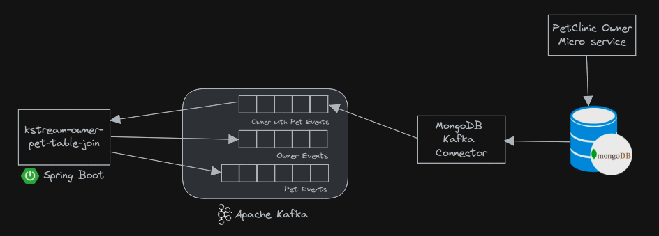

# kstream-owner-pet-table-join
<hr/>

This application demonstrates how to build a streaming pipeline using Kafka Streams to join and un-join data from Kafka topics.

### Join Owner and Pet Streams
The diagram below shows an overview of the first streaming pipeline


This pipeline will read events from the owner topic (`mysql.petclinic.owners`) and the pet topic (`mysql.petclinic.pets`) and process them in a streaming pipeline:

  - The events from the two topics are joined on Owner ID
  - Each owner is enriched with its pets data
  - The aggregated data is written out to a third topic `mongo.petclinic.owner.pets`

The below table summarizes the `owners` and `pets` event generated by Debezium and the nested structure generated by the KStream pipeline

| Owner Event                                                                                                                                                                                                     | Pet Event                                                                                                                                       | Owner with Pet Event                                                                                                                                                                                                                                                                                                                                                                                                                                                                                                                     |
|-----------------------------------------------------------------------------------------------------------------------------------------------------------------------------------------------------------------|-------------------------------------------------------------------------------------------------------------------------------------------------|------------------------------------------------------------------------------------------------------------------------------------------------------------------------------------------------------------------------------------------------------------------------------------------------------------------------------------------------------------------------------------------------------------------------------------------------------------------------------------------------------------------------------------------|
| <pre>{<br>&nbsp;"id": 1,<br>&nbsp;"first_name": "George",<br>&nbsp;"last_name": "Franklin",<br>&nbsp;"address": "110 W. Liberty St.",<br>&nbsp;"city": "Madison",<br>&nbsp;"telephone": "6085551023"<br>}</pre> | <pre> {<br>&nbsp;"id": 1,<br>&nbsp;"name": "Leo",<br>&nbsp;"birth_date": 11207,<br>&nbsp;"type_id": 1,<br>&nbsp;"owner_id": 1<br>&nbsp;} </pre> | <pre> {<br>&nbsp;"owner": {<br>&nbsp;&nbsp;"id": 1,<br>&nbsp;&nbsp;"first_name": "George",<br>&nbsp;&nbsp;"last_name": "Franklin",<br>&nbsp;&nbsp;"address": "110 W. Liberty St.",<br>&nbsp;&nbsp;"city": "Madison",<br>&nbsp;&nbsp;"telephone": "6085551023"<br>&nbsp;},<br>&nbsp;"pets": [<br>&nbsp;&nbsp;{<br>&nbsp;&nbsp;&nbsp;"id": 1,<br>&nbsp;&nbsp;&nbsp;"name": "Leo",<br>&nbsp;&nbsp;&nbsp;"birth_date": "11207",<br>&nbsp;&nbsp;&nbsp;"type_id": 1,<br>&nbsp;&nbsp;&nbsp;"owner_id": 1<br>&nbsp;&nbsp;}<br>&nbsp;]<br>}</pre> |


### Un-join Owner with Pet Streams
The diagram below shows an overview of the second streaming pipeline



This pipeline will read events from the kafka topic (`mongo.owners-db.owner-with-pets`) and process them in a streaming pipeline:

  - The events from the single topic are split into two topics `kstream.owners.unwrap` and `kstream.pets.unwrap`
  - The list of pets are flattened as individual events in `kstream.pets.unwrap`

The below table summarizes the event generated by MongoDB Kafka connector into `mongo.owners-db.owner-with-pets` and the split events generated by the KStream pipeline

| Owner with Pets Event                                                                                                                                                                                                                                                                                                                                                                                                                                                                                                                                                                                                                                                                                                                                             | Owner Event                                                                                                                                                                                                     | Pet Event                                                                                                                                                                                                                                                                                                                                                              |
|-------------------------------------------------------------------------------------------------------------------------------------------------------------------------------------------------------------------------------------------------------------------------------------------------------------------------------------------------------------------------------------------------------------------------------------------------------------------------------------------------------------------------------------------------------------------------------------------------------------------------------------------------------------------------------------------------------------------------------------------------------------------|-----------------------------------------------------------------------------------------------------------------------------------------------------------------------------------------------------------------|------------------------------------------------------------------------------------------------------------------------------------------------------------------------------------------------------------------------------------------------------------------------------------------------------------------------------------------------------------------------|
| <pre> {<br>&nbsp;"owner": {<br>&nbsp;&nbsp;"id": 1,<br>&nbsp;&nbsp;"first_name": "George",<br>&nbsp;&nbsp;"last_name": "Franklin",<br>&nbsp;&nbsp;"address": "110 W. Liberty St.",<br>&nbsp;&nbsp;"city": "Madison",<br>&nbsp;&nbsp;"telephone": "6085551023"<br>&nbsp;},<br>&nbsp;"pets": [<br>&nbsp;&nbsp;{<br>&nbsp;&nbsp;&nbsp;"id": 1,<br>&nbsp;&nbsp;&nbsp;"name": "Leo",<br>&nbsp;&nbsp;&nbsp;"birth_date": "11207",<br>&nbsp;&nbsp;&nbsp;"type_id": 1,<br>&nbsp;&nbsp;&nbsp;"owner_id": 1<br>&nbsp;&nbsp;},<br>&nbsp;&nbsp;{<br>&nbsp;&nbsp;&nbsp;"id": 2,<br>&nbsp;&nbsp;&nbsp;"name": "Basil",<br>&nbsp;&nbsp;&nbsp;"birth_date": "10000",<br>&nbsp;&nbsp;&nbsp;"type_id": 2,<br>&nbsp;&nbsp;&nbsp;"owner_id": 1<br>&nbsp;&nbsp;}<br>&nbsp;]<br>}</pre> | <pre>{<br>&nbsp;"id": 1,<br>&nbsp;"first_name": "George",<br>&nbsp;"last_name": "Franklin",<br>&nbsp;"address": "110 W. Liberty St.",<br>&nbsp;"city": "Madison",<br>&nbsp;"telephone": "6085551023"<br>}</pre> | <pre> {<br>&nbsp;&nbsp;"id": 1,<br>&nbsp;&nbsp;"name": "Leo",<br>&nbsp;&nbsp;"birth_date": 11207,<br>&nbsp;&nbsp;"type_id": 1,<br>&nbsp;&nbsp;"owner_id": 1<br>&nbsp;}</pre><pre><br>&nbsp;{<br>&nbsp;&nbsp;"id": 2,<br>&nbsp;&nbsp;"name": "Basil",<br>&nbsp;&nbsp;"birth_date": "10000",<br>&nbsp;&nbsp;"type_id": 2,<br>&nbsp;&nbsp;"owner_id": 1<br>&nbsp;} </pre> |


The application is developed using Spring Boot 3.0 and [Spring Cloud Stream Kafka streams binder](https://docs.spring.io/spring-cloud-stream-binder-kafka/docs/current/reference/html/spring-cloud-stream-binder-kafka.html#_kafka_streams_binder)

## Building and Running the application

### Prerequisites
The following should be installed in your system:

* [Docker](https://docs.docker.com/engine/install/)
* [Docker Compose](https://docs.docker.com/compose/install/)

### Running kstream-owner-pet-table-join application

- From a new terminal window inside the `kstream-owner-pet-table-join` folder, run the following command:

    ```bash
    docker compose up -d
    ```
  This will start Zookeeper, Kafka and Kafka UI containers.


- Run the following command to start the `kstream-owner-pet-table-join` application
    ```bash
    ./mvnw spring-boot:run
    ```
  
- Run the `GenerateOwnerAndPet` java code to produce test `owner` and `pet` events into `mysql.petclinic.owners` and `mysql.petclinic.pets` topics respectively.


- Access the Kafka UI [topic](http://localhost:8087/ui/clusters/local/all-topics/mongo.petclinic.owner.pets/messages?keySerde=String&valueSerde=String&limit=100) to see the events generated in `mongo.petclinic.owner.pets`


- Run the `GenerateOwnerWithPets` java code to produce test `OwnerWithPets` events into `mongo.owners-db.owner-with-pets` topic.


- Access the Kafka UI [Owner Topic](http://localhost:8087/ui/clusters/local/all-topics/kstream.owners.unwrap/messages?keySerde=String&valueSerde=String&limit=100) to see the events genered in `kstream.owners.unwrap` topic and access the Kafak UI [Pet topic](http://localhost:8087/ui/clusters/local/all-topics/kstream.pets.unwrap/messages?keySerde=String&valueSerde=String&limit=100) to see the events generated in `kstream.pets.unwrap` topic.
