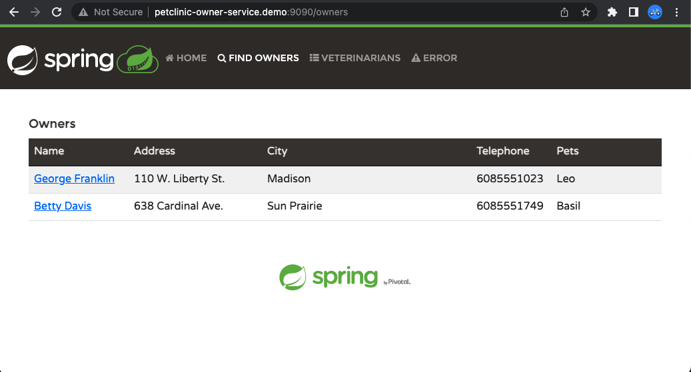

# PetClinic Owner Service
<hr/>

The PetClinic Owner Service is an independent service that provides similar functionality previously contained in the [Sprint PetClinic](../spring-petclinic) monolith. This repo aims to incrementally re-write the owner functionality of the Spring PetClinic monolith i.e. Add/Edit Owner details, Add/Edit Pet 



### Technologies used

* Language: Kotlin
* Core framework: Spring Boot 3 with Spring Framework 6 Kotlin support
* Server: Apache Tomcat
* Web framework: Spring MVC
* Templates: Thymeleaf and Bootstrap 5
* Persistence : Spring Data MongoDB
* Databases: MongoDB
* Build: Gradle Script with the Kotlin DSL
* Testing: Junit 5, Mockito and AssertJ

### Prerequisites
The following should be installed in your system:

* [Docker](https://docs.docker.com/engine/install/)
* [Docker Compose](https://docs.docker.com/compose/install/)

### Running PetClinic Owner Service locally

- From a new terminal window inside the `petclinic-owner-service` folder, run the following command:

    ```bash
    docker compose up -d
    ```
  This will start the Mongo DB as a container.


- Run the following command 
    ```bash
    ./gradlew bootRun
    ```

- Update `/etc/hosts` file in your local system to map a sample domain to `localhost`

  ```bash
  sudo vi /etc/hosts
  ```
  After you enter your password, add the below domain mapping

  ```text
  127.0.0.1 petclinic-owner-service.demo
  ```

You can then access PetClinic here: [http://petclinic-owner-service.demo:9090](http://petclinic-owner-service.demo:9090)
