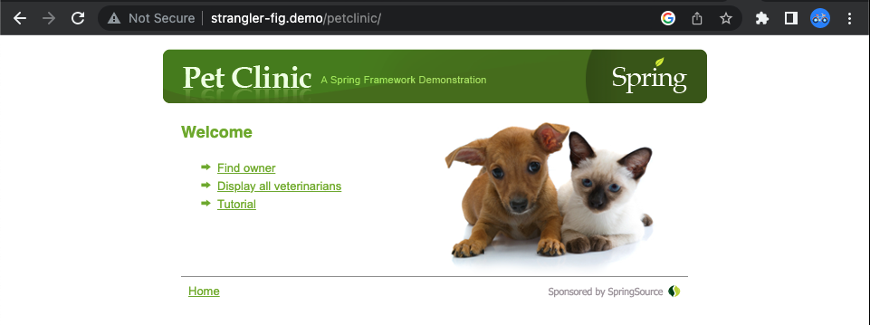

# Spring PetClinic Sample Application
<hr/>

The Spring PetClinic is a sample application designed to show how the Spring stack can be used to build simple, but powerful database-oriented applications. This fork of the Spring PetClinic [project](https://github.com/spring-petclinic) is a monolithic application built using legacy Spring Framework 3 configuration with a 3-layer architecture (i.e. presentation --> service --> repository)



The project uses Maven to structure and bootstrap a Spring core 3.0.6 application deployed onto a Tomcat 8.5 container. MySQL 5.7.8 database provides persistent storage support 


## Prerequisites
<hr/>
The following should be installed in your system:

* [Docker](https://docs.docker.com/engine/install/)
* [Docker Compose](https://docs.docker.com/compose/install/)


## Running PetClinic locally
<hr/>

- From a new terminal window inside the `spring-petclinic` folder, run the following command:

    ```bash
    docker compose up -d
    ```
    This will build the web application and run it as as docker container. The MySQL database is also started as a container

  
- Wait for all docker containers to be up and running. Check using the following command:

   ```bash
   docker compose ps
  ```

You can then access PetClinic here: [http://localhost:8080/](http://localhost:8080/)


